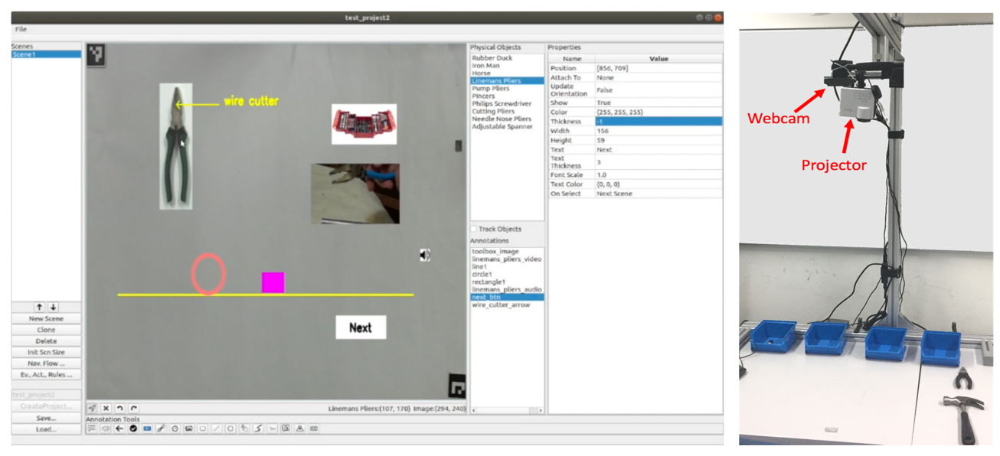
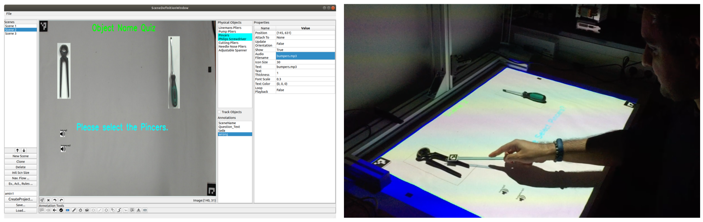
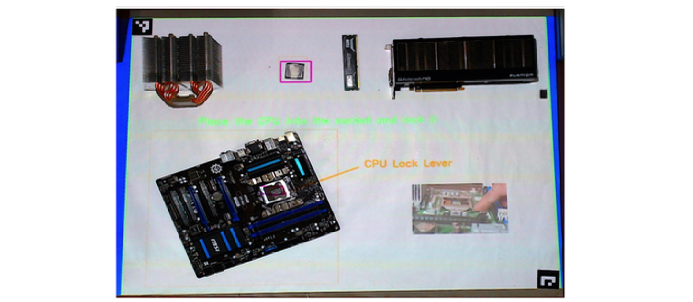
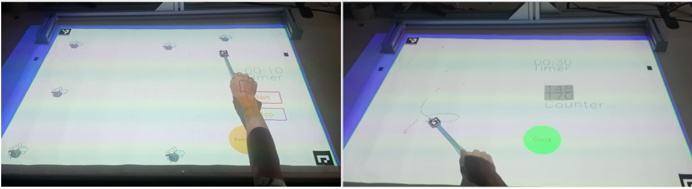

# ISAR: An Authoring System for Interactive Tabletops

ISAR is an augmented Reality (AR) authoring system for interactive tabletops.

Authoring systems for AR try to compensate the complexity and challenge of development of AR applications by providing frameworks that can be reused. These frameworks are available at different levels of abstraction, from software libraries to high-level GUI solutions
targeted towards end-users. 

ISAR targets end-user development of AR applications for an interactive tabletop. By using ISAR, different domain experts, such as teachers or physiotherapist, who do not have any expertise in programming can created their own interactive applications. 

ISAR consists of camera-projector based interactive tabletop and an authoring environment. The application author (e.g. a teacher) uses the authoring environment to creates an interactive application by defining scenes and interactions. A scene is a combination of virtual content and physical objects. The application is then projected on the tabletop and the application user interacts with it. 

 
*ISAR Authoring Environment and camera-project setup.* 

The application author creates an interactive application by defining the scenes and interaction rules. Each scene consists of different annotations, such as text, images, geometric shapes, videos and audio, etc., and physical objects. To design a scene the  application author directly sees a camera feed of the table and can test his application directly from the authoring environment. The annotations can be attached to the scene, or attached to the physical objects. In the latter case their rendering is changed depending on the position and orientation of the physical objects.

Beside the scenes, the application author also defines interaction rules. Interaction rules
define the response of the table upon different interactions of the user, the form of “If EVENT then ACTION”. For example, the application author can define a rule that plays a sound as soon as an object appears on the table. Several templates for interaction rules are available in ISAR, and the set of events and actions can also be extended by a programmer. 

ISAR can be used to create interactive tabletop applications for different domains. In the following three applications are shown: An application for learning vocabulary; An application for guiding through a manual workflow; And two games for cognitive and upper body motor rehabilitation.

*Example of the vocabulary learning application: An application for learning the name of different tools. When the user points at the pincers, a sound is played for positive feedback. Selecting the screw driver, plays a negative feedback sound.* 

An  interactive application was created using ISAR to guide the user through a workflow of assembling a computer mainboard. Scenes were created for each step of the workflow. Each scene consisted of hints and guidance on how to perform the step, such as arrows that show where to place a part. Interaction rules defined the transition between scenes and if a part was missing or the wrong part was picked. 

  
*A scene of mainboard assembly workflow. The part (CPU) is highlighted and an arrow shows the position of the CPU lock lever. A video also shows how to close the CPU lock.* |

ISAR can be used to create interactive applications that support medical rehabilitation, for example post stroke rehabilitation. The application consists of two games. In the first game, the user (e.g. a post stroke patient) should hit moving flies on the table. In the second application the user should follow a projected path on the table and gest scores on how well he could follow the path. In both cases interaction rules are defined for calculating feedback that is shown using a feedback annotation. 

  
*Hit the flies and follow the path game for rehabilitation.* 

A video demo of the system can be found here: https://www.youtube.com/watch?v=KyvFT0S5rww

 